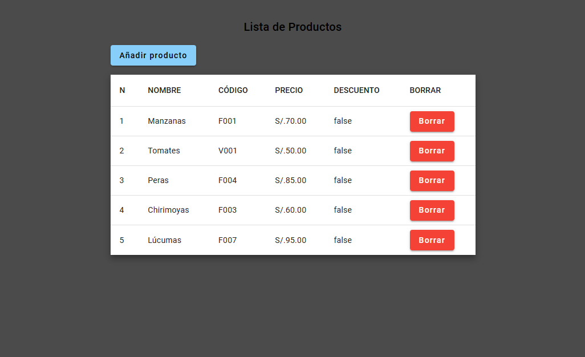
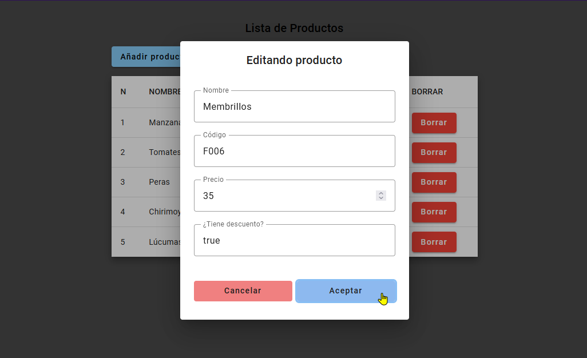
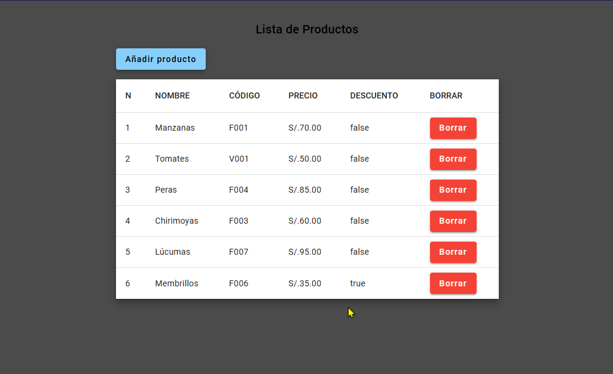
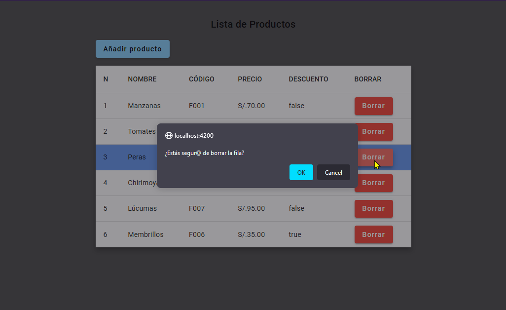
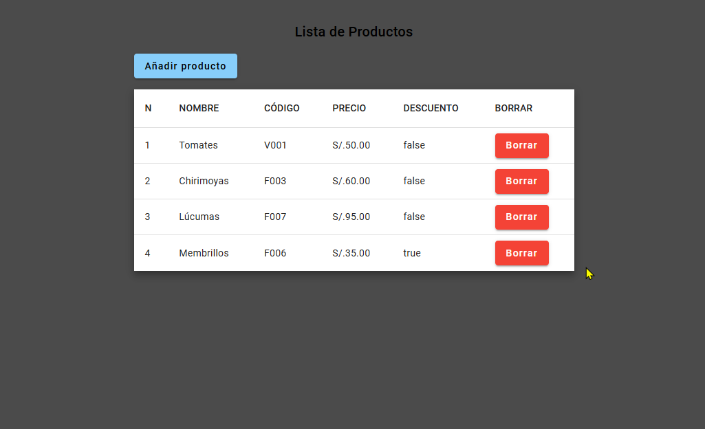

# Tarea29

Demo: <https://araceliponce.github.io/tarea29/>

- La aplicación muestra una tabla de productos obtenida de un array de objetos

- El botón de añadir producto abre un dialog con el que se pueden agregar productos a la tabla

- Cada botón borrar permite borrar el producto ded su respectiva fila. Antes de borrarlo pide una confirmación del usuario

Tanto después de agregar como de borrar un producto, la tabla se auto-actualiza

